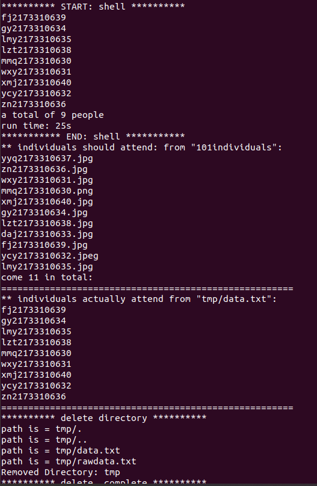

# IECS-Attendance
## 大创项目：上课考勤系统
#### 环境搭建
```shell
# 新建虚拟机后调整分辨率
apt-get autoremove open-vm-tools
apt-get install open-vm-tools-desktop

# 装依赖的工具
sudo apt install python3
sudo apt install gcc	
sudo apt install cmake
sudo apt install python3-pip

# 装 face_recognition 项目
pip3 --default-timeout=6000 install face_recognition -i https://pypi.doubanio.com/simple/
```

解决共享文件夹启用后，重启失效（显示启用，但hgfs下没有共享文件夹）问题：
  禁用共享后进入 /mnt
```shell
sudo rm -rf hgfs
```
  再开启共享

#### 设计思路

​		

#####  无法识别解决方案：

​		换用高像素图片，不要用 .jfif 格式图片，换格式。

#####  欠学习？

​		11个女的匹配我的照片，4个匹配上，匹配11个中随便一个人的，8到10个匹配上。难道是我太帅了？

​		解决方法，调整 tolerance 参数，目前手动调参数，0.406是"黄金参数"

##### 自动校准参数

​		解决方法：没有明确的思路，可以手动解决，或培训后叫组员解决

##### 待解决：少了谁

​		思路：获取文件夹下所有文件名；用C语言**执行**这两个脚本，分别_获取_：识别出的文件名；列出的文件名（总的）【分别输出在两个文件中】。_存_于数组中。**排序**（map? vector?），**算法**算出少了谁，**更新（取交集）**初始化列表（一开始所有人都没来）

##### 解决过程

​		C++ 直接获取 should attend individuals

​		出现 stray ‘\302’ in program 这种错误是复制粘贴时格式不对

​		目前，两个 vector<string> 内的内容需要比较，排序。文件后缀需要去除。 

​		已经得到了大致的数据
